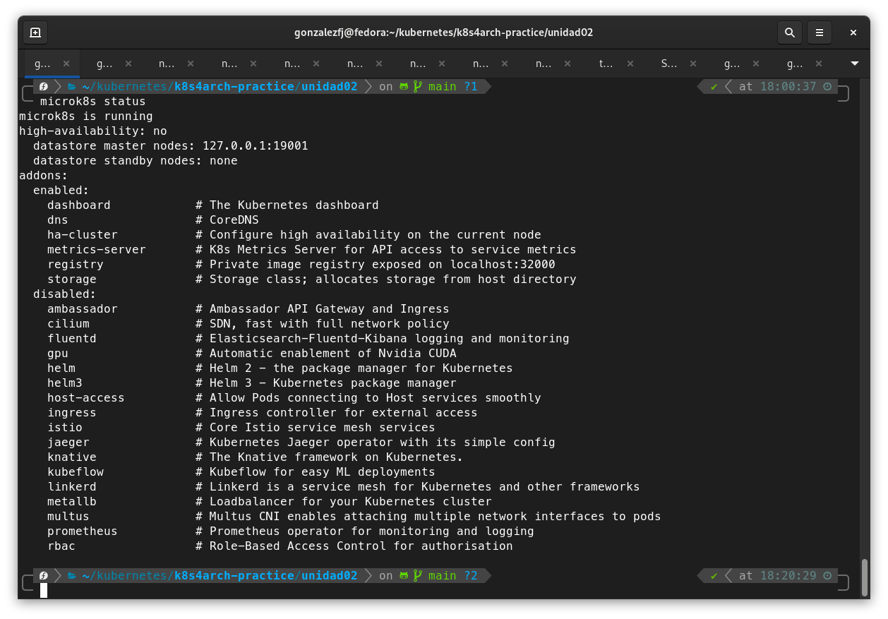
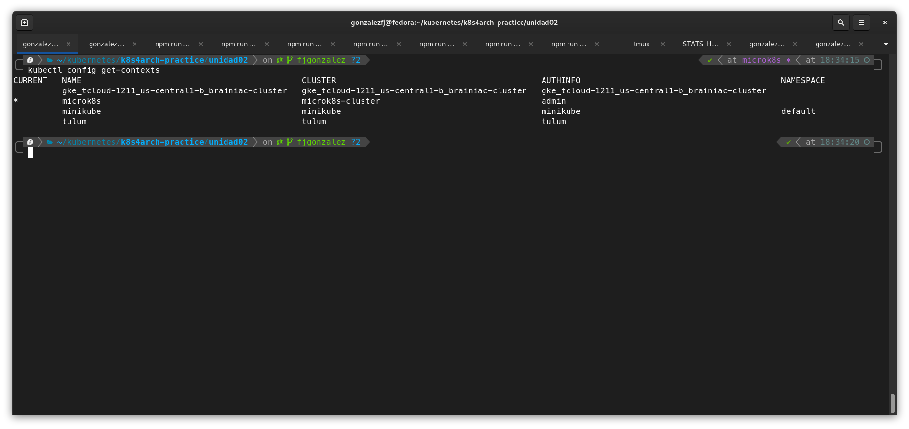

# Instalación mediante microk8s

Entorno:

- OS: Fedora release 33 (Thirty Three) x86_64
- Kernel: 5.11.11-200.fc33.x86_64

Primero instalé snap, luego desde snap instalé microk8s, agregué mi usuario al grupo microk8s y finalmente esperé el status de microk8s

```
sudo snap install microk8s --classic --channel=1.19
sudo usermod -a -G microk8s $USER
sudo chown -f -R $USER ~/.kube
su - $USER
microk8s status --wait-ready
```

El status falló me faltaban algunas configuraciones

```
microk8s status
```

Para ver que me faltaba, tal y como decía la salida del programa me fijé con inspect, y agregué el registry a mi docker, configure para usar cgroup v1, y luego iptables

```
microk8s inspect
vim /etc/docker/daemon.json
sudo vim /etc/docker/daemon.json
sudo grubby --update-kernel=ALL --args="systemd.unified_cgroup_hierarchy=0"
sudo iptables -P FORWARD ACCEPT
reboot
```

Reincié y ahora si estaba funcionando:

```
microk8s status
```

Luego habilité: dashboard registry dns

```
microk8s enable dashboard registry dns
token=$(microk8s kubectl -n kube-system get secret | grep default-token | cut -d " " -f1)
microk8s kubectl -n kube-system describe secret $token
```

Me queda pendiente configurar los otros nodos, podrían ser físicos o maquinas virtuales, pero levantaría 3 nodos master y 2 nodos worker.

Adjunto capturas:



Luego configuré kubectl de mi máquina para más comodidad:

```
microk8s config > config2
KUBECONFIG=~/.kube/config:./config2 kubectl config view --flatten > /tmp/config
mv /tmp/config ~/.kube/config
kubectl config use-context microk8s
```

```
kubectl config get-context
```


