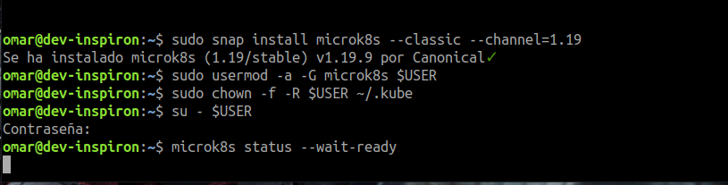
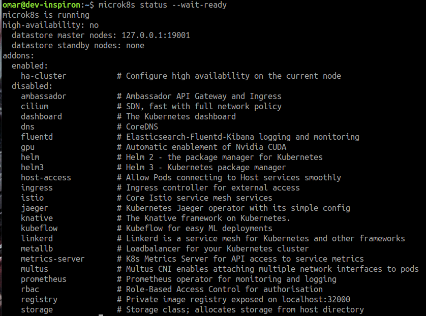
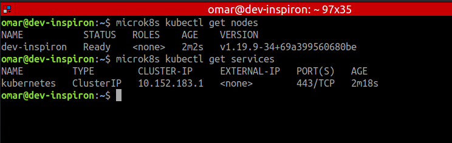
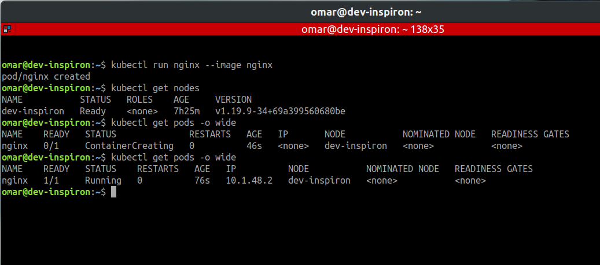
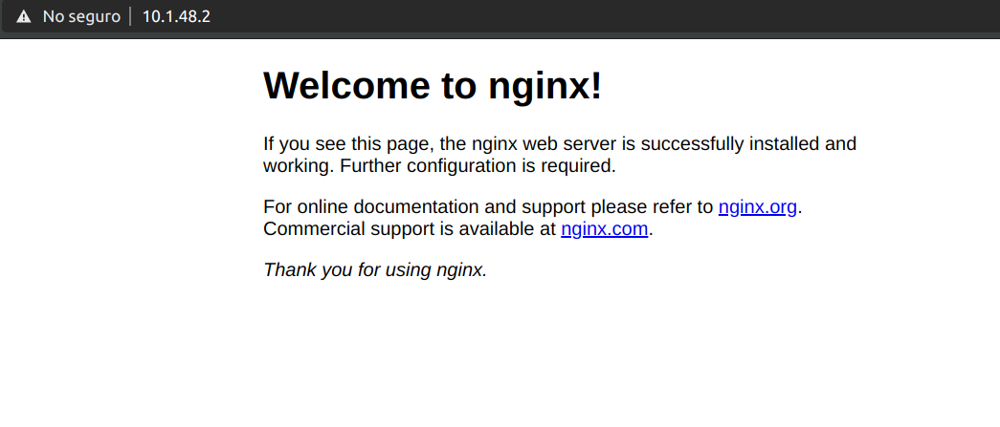
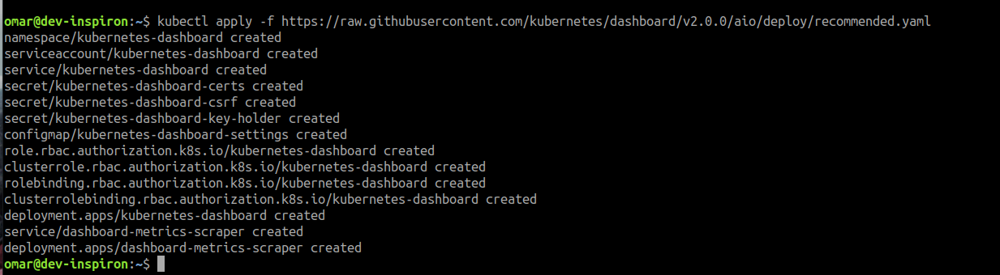
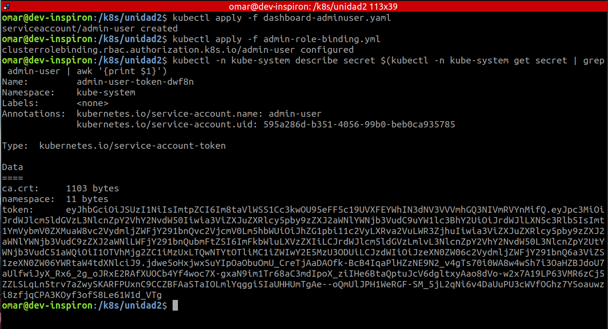
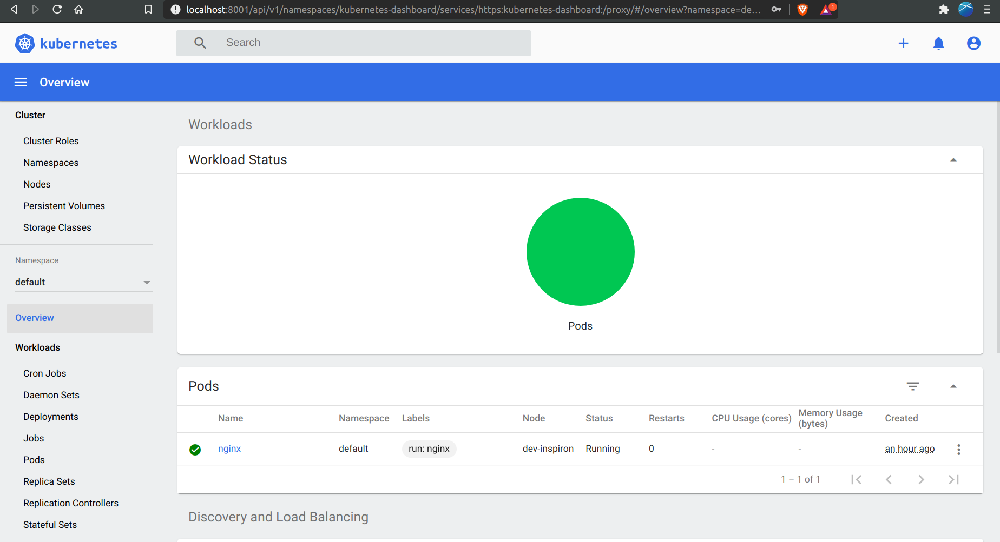
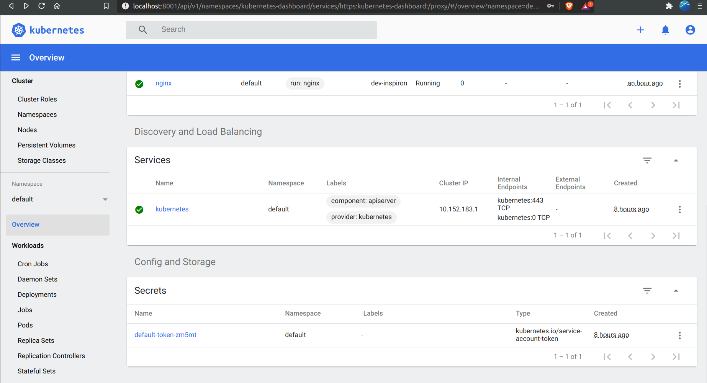

# Resolucion Ejercicio

Para la resolucion del ejercicio se trabajo directamente sobre una maquina con ubuntu 18.04 y se genero un cluster local con microk8s.

## Desarrollo


1) Instalacion Microk8s y Asignacion de permisos



2) Visualizacion del status del Cluster



3) Nodos & Services



4) Generacion de alias

Se edito el archivo ~/.bashrc y se agrego el siguiente contennido:

```
if [ -f ~/.bash_aliases ]; then
    . ~/.bash_aliases
fi

```

Se crea el archivo ~/.bash_aliases

```
alias kubectl='microk8s kubectl'

```

Ahora vamos a despleguer un pod con nginx y verificamos el despliegue del mismo



Lo verificamos por Browser




Ahora vamos a desplegar el add-on del dashboard con las configuraciones recomendadas.

Para ello se utiliza el siguiente archivo

[--> dashboard](./yaml/recommended.yaml)



Previo a la generacion del user y role para entrar al dashboard se habilito los add-ons en microk8s

* microk8s enable dashboard
* microk8s enable rbac

Posterior a esto se ejecutan:

```
kubectl apply -f dashboard-adminuser.yaml

kubectl apply -f admin-role-binding.yml 

kubectl -n kube-system describe secret $(kubectl -n kube-system get secret | grep admin-user | awk '{print $1}')

```
[--> dashboard-adminuser.yaml](./yaml/dashboard-adminuser.yaml)

[--> admin-role-binding.yaml](./yaml/admin-role-binding.yaml)


 

Visualizamos el Dash







Se busca crear el **cluster Kubernetes** de base sobre el cual trabajaremos todo el resto del curso. 

**Pendientes**:

- Para obtener una alta disponibilidad hay que virtualizar microk8s utilizando vagrant o simil, o bien agregar otra maquina al cluster la misma debera estar dentro de la misma red.   

 
