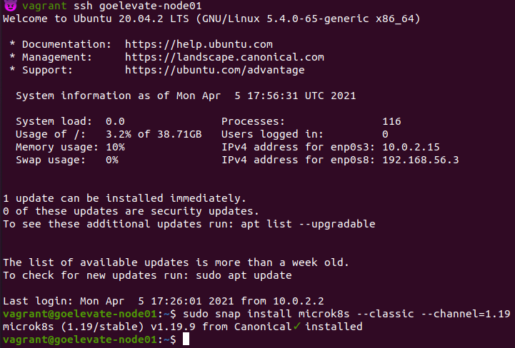
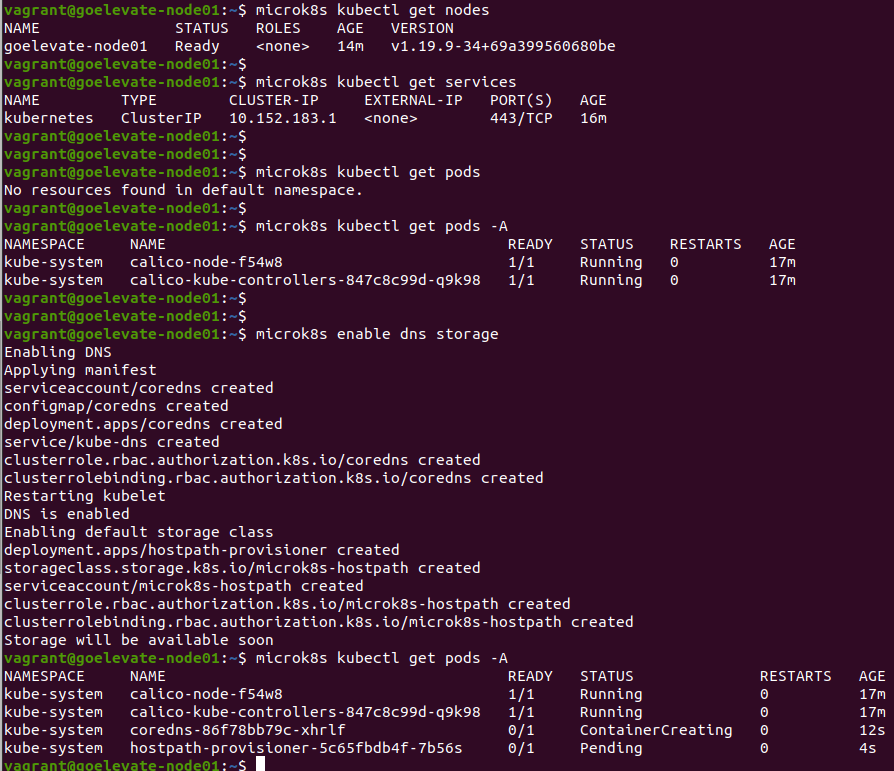
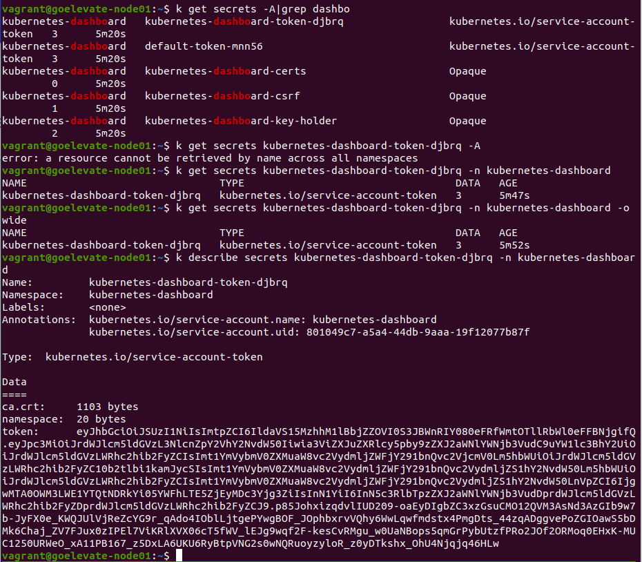
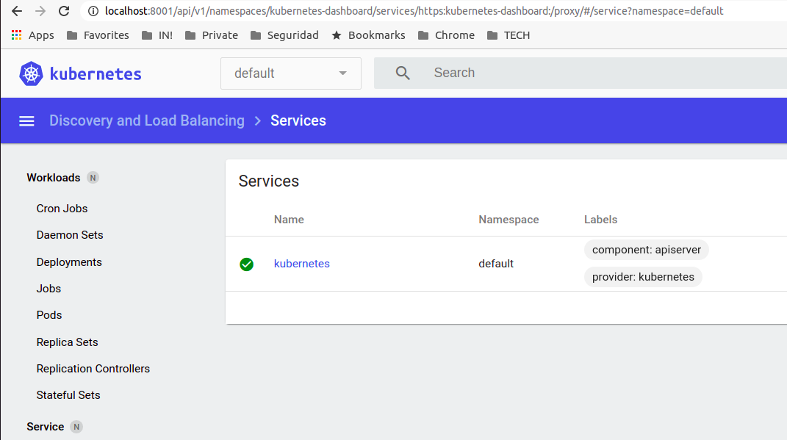
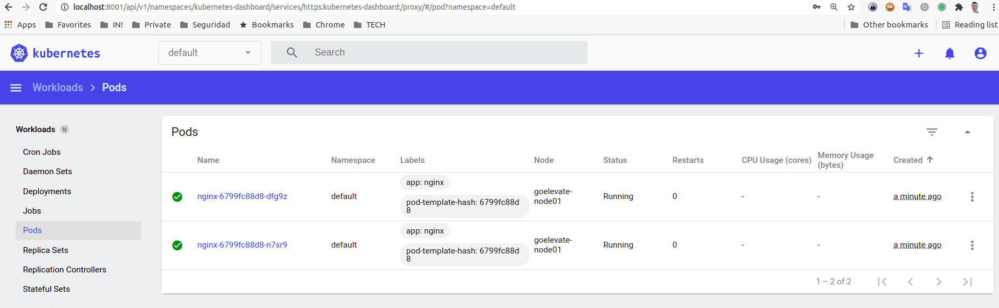
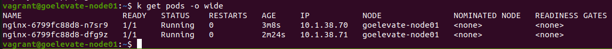
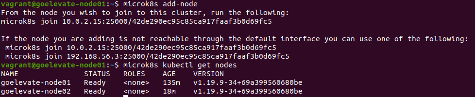
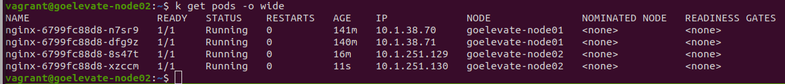
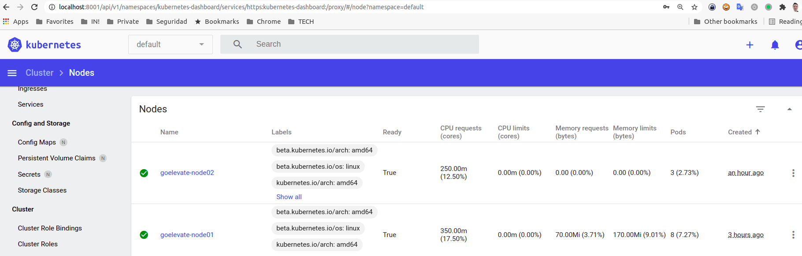

Para la resolución, generé dos máquinas virtuales utilizando **vagrant con virtualbox**.
Para ello, utilicé el Vagrantfile existente en la carpeta assets.

> [Vagrantfile](./assets/Vagrantfile)

Finalmente, ingresamos en el nodo01 (goelevate-node01) y procedemos con la instalación de paquetes e inicialización del cluster.

## 1) Instalar Microk8s
$ `sudo snap install microk8s --classic --channel=1.19`

## 2) Agregar grupos con permisos para administrar el cluster al usuario vagrant
$ `sudo usermod -a -G microk8s $USER`

$ `sudo chown -f -R $USER ~/.kube`

Para reingresar a la sesión:

$ `exit`

$ `vagrant ssh goelevate-node01`

$ `microk8s status --wait-ready`

microk8s is running
....

A continuación, vemos que no hay pods propios ejecutándose, aunque sí del sistema. 
Vamos a proceder con la instalación de 2 add-ons (dns y storage)

## 3) Instalación de Dashboard

$ `microk8s kubectl apply -f https://raw.githubusercontent.com/kubernetes/dashboard/v2.2.0/aio/deploy/recommended.yaml`

Publico el puerto para acceder:
$ `nohup microk8s kubectl proxy --address=0.0.0.0 --port=8001 &`
[1] 42231

## 4) Genero un alias para trabajar con mayor comodidad
$ `alias k="microk8s kubectl"`

## 5) Obtengo el secret para acceder al dashboard

## 6) Deployamos un pod con 1 replica

$ `k create deployment nginx --image=nginx`
deployment.apps/nginx created

Luego, escalamos a 2 contenedores, pero vemos que los dos se ejecutan en el único nodo disponible (goelevate-nodo01)

# CLUSTER

Para el armado del cluster, necesitamos que todos los nodos tengan la hora sincronizada con un ntp server, para lo cual instalamos los paquetes necesarios:

$ `sudo apt-get update`
$ `sudo apt-get install ntp`
$ `sudo systemctl restart ntp`

## En el nodo master, ejecuto:
$ `microk8s add-node`
Eso nos devuelve el comando a ejecutar en el node que queremos sumar al cluster. Al finalizar, podremos ver que los 2 nodos son partes del cluster.

## Escalo las replicas a 4, esperando que se haya distribuido la carga
$ `k scale --replicas=4 deployment/nginx`

