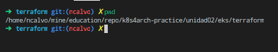
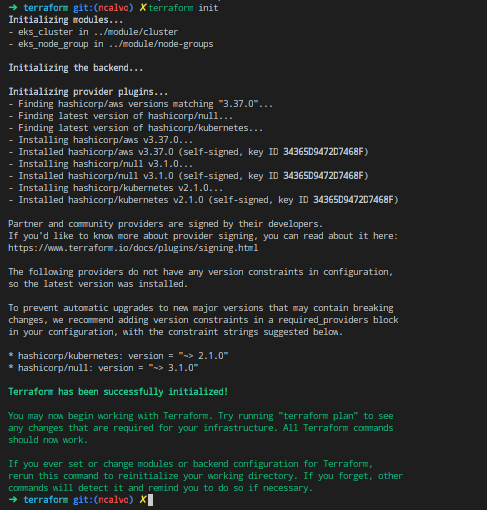
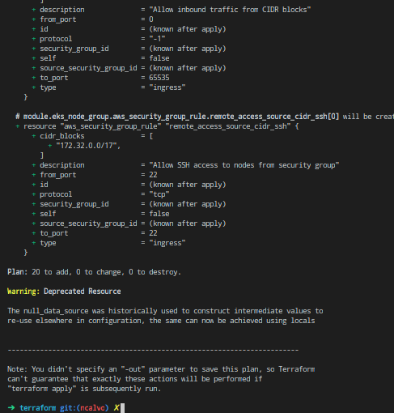
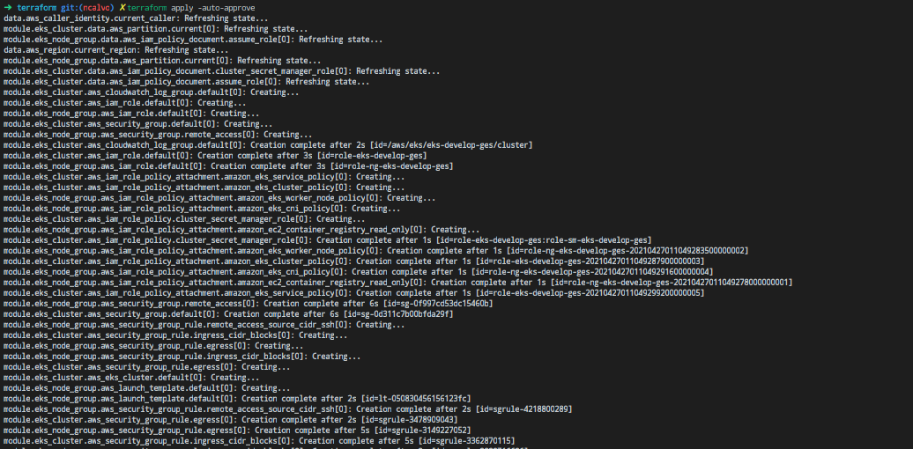
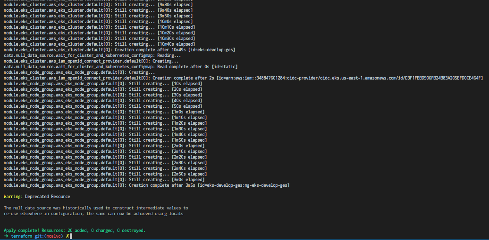
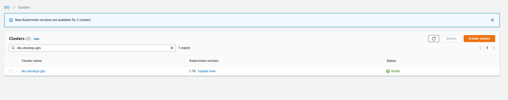
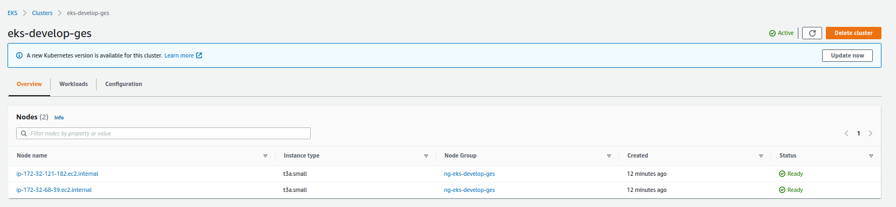
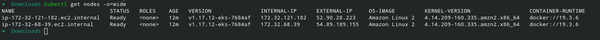
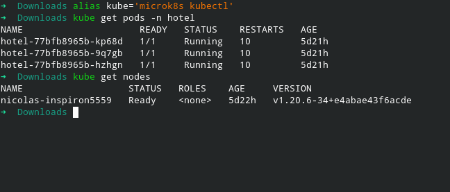

# How to use EKS Terraform Module?

### Requirements
- An **AWS** account

- An **IAM USER** with keys

- **Terraform** installed on your machine

Reeplace in `variables.tf` with your `cidr_block` and `profile`

`variables.tf`

    variable "profile" {
        default = ""
    }
    variable "cidr_block" {
        default = ""
    }
    variable "ec2_ssh_key" {
        default = ""
    }

Reeplace in `eks.tf` config file with your own `vpc_id`, `subnet_ids` and `private_subnets` with your vpc and subnets

`eks.tf`

    locals {
        tags                       = merge(var.tags, map("kubernetes.io/cluster/${var.name}", "shared"))
        eks_worker_ami_name_filter = "amazon-eks-node-${var.kubernetes_version}*"
        vpc_id                     = ""
        public_subnets             = ["", ""]
        private_subnets            = ["", ""]
        subnet_ids                 = concat(local.public_subnets, local.private_subnets)
    }

Once you replace on both files, you need to initialize terraform, create a plan, and then apply the changes:

We need to make sure that we are in `/k8s4arch-practice/unidad02/eks/terraform`

Let's initialize our terraform project `terraform init`

Let's do a `terraform plan`:

Let's deploy our infrastructure `terraform apply`:

### Evidence

### Microk8s

