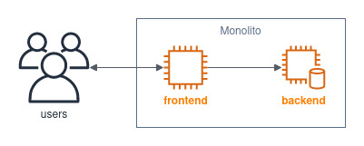

# Unidad 03 - Kubernetes 101

¡Bienvenidos!

Esta práctica se corresponde a la unidad teórica número 3 sobre los objetos básicos que nos ofrece la plataforma para modelar aplicaciones y como puedo hacer uso de ellos.

## Enunciado

Usted es elegido como Arquitecto Principal en una organización cuyo principal foco es migrar parte de sus soluciones, que actualmente se jactan de ser monolíticas, a un entorno más _cloud-native_.

Por ende, no solo deberemos proporcionar el entorno necesario para que estas soluciones puedan ser ejecutadas tal cual lo hacen hoy, sino luego también repensarlas, _¿por qué no?_, como soluciones mas distribuidas orientadas a lo que hoy conocemos como arquitecturas de microservicios.  

Pero como todos sabemos, las migraciones de estilos arquitectónicos suelen ser tediosas y costosas, con lo cual iremos paso a paso.

En esta oportunidad, particularmente nos toca atacar una problemática referida a una solución que permite buscar y reservar hoteles. Para dar un poco de contexto, consta de una aplicación con un frontend implementado en ReactJS (gracias Camila Macko por el [aporte](https://github.com/CamilaMacko/hotels-frontend)) y un backend hecho en Python, tiene una persistencia que viene acoplada al backend, con lo cual no hay integraciones con servicios externos.

La arquitectura de la solución se muestra a continuación:

Como bien dijimos, todos estos componentes forman parte de un componente **monolítico**. 

Pero gracias a la ayuda de parte del equipo que colabora en la implementación y soporte de la solución, ¡pudimos containerizar la gran aplicación monolítica! Después de un arduo trabajo, se logró armar una imagen docker que se compone de todos los componentes de la solución: 

- capa frontend
- capa backend
- persistencia

Nos dijeron que la imagen docker de la solución la podemos encontrar con la siguiente etiqueta: `ghcr.io/go-elevate/k8s4arch-hotels:monolith`    

Nos piden entonces modelar la aplicación para poder ejecutarla dentro de Kubernetes.

Consideraciones:

- Utilizar por ahora los objetos vistos en la unidad teórica
- Ubicar la aplicación en un _namespace_ particular, sabiendo que eventualmente surgirán muchas otras aplicaciones
- Cumplir con los atributos de calidad que esperamos para una aplicación de esta índole: alta disponibilidad, elasticidad, tolerancia a fallos.

## Entrega y Devolución

Con respecto a la entrega, de ahora en más el formato de entrega será subir los manifiestos YAML en su versión final al branch de cada alumno en el repositorio. 

El docente corregirá los manifiestos YAML, probándolos contra su entorno configurado de Kubernetes. En base a los resultados que arroje ese estado deseado, será la nota correspondiente para el alumno.  

La publicación oficial de la práctica será por la plataforma Google Classroom, donde se generará un material con devolución pautada para una fecha en particular y que es calificable.

## Aclaraciones

Al alumno se le proporcionó:

- un manual teórico con toda la información relevante a la unidad.
- un manual estilo guía o _walkthrough_ con información que puede utilizar a modo de soporte para la resolución de la ejercitación en cuestión.

Si alguno de estos documentos no está en su poder, contactarse con el personal docente para resolver la situación.