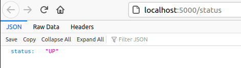

# Unidad 05 - Manejo de Configuración

¡Bienvenidos!

Esta práctica se corresponde a la unidad teórica número 5 donde se vieron que estrategias se utilizan para parametrizar configuración, que debe ser gestionada en forma aislada al código aplicativo (siguiendo lo que recomienda 12FactorApp). Por otro lado, entre otros temas, recalcamos el manejo de los recursos en forma declarativa que puede solicitar una aplicación para ejecutar.

## Enunciado

#### Parte 1

Recordando la última práctica, el equipo de desarrollo pudo desacoplar exitosamente el backend de la solución originalmente monolítica. 

Es hora de empezar a meterle foco al backend para adaptarlo a las buenas prácticas que nos brinda Kubernetes para los microservicios.

Como primer necesidad, que previamente no era una tarea simple debido al acoplamiento, surge la posibilidad de **extraer la información que es meramente de configuración** del resto de la lógica de negocio. Esta información evoluciona de una manera distinta al código aplicativo, con lo cual debe ser gestionada en forma externalizada.

El equipo nos comenta que pudo extraer, en principio, dos variables referente a la comunicación con la base de datos, a saber:

- `DB_PATH` la cual se corresponde a la ruta donde se encuentra la información persistida. Contendrá el valor `/db/hotels.json`
- `DB_TABLE` la cual refiere al nombre que tiene la tabla que aloja la información de hoteles. Contendrá el valor `hotels`

Nos piden crear un despliegue en Kubernetes que **permita inyectar esas variables previo a ejecutar la aplicación**. _Quedará a criterio del lector si la información es considerada sensible o no, como para modelarlo con el recurso correspondiente_. 

**NOTA: No olvidar agregar lo visto en la práctica pasada que tambien aplica a este despliegue de backend.**

Consideraciones sobre el microservicio backend:

- Recordemos que la imagen se encontraba con la siguiente etiqueta: `ghcr.io/go-elevate/k8s4arch-hotels-backend:slim`
- Necesita ser identificado de igual manera que se hizo con el monolito. _Probablemente no sean las mismas etiquetas._
- La aplicación que contiene debe ejecutar en el puerto `5000`
- Además, cuenta con un endpoint HTTP donde expone su estado de salud, `/status`. Reconfigurar los probes acordes a esta definición según un criterio acorde a la naturaleza de la aplicación. 

Recuerden que para probar la API y corroborar que levantó satisfactoriamente, siempre pueden usar un _port forwarding_ al puerto del contenedor.

 

#### Parte 2

**LA APP CRASHEA** 

El equipo sostiene que al agregar dependencias nuevas sin haberlas probado exhaustivamente, se atentó contra el consumo de recursos, que se está disparando en el _startup_ de la aplicación.

¿Qué podemos hacer como Arquitectos para solucionar esta problemática? _No vale llamar a nadie ni derivar el problema, solo podemos diseñar una solución que ataque la problemática para evitar atentar la disponibilidad_ 

Utilice el manifiesto tal cual quedó de la parte 1 de esta práctica e incorpore los cambios necesarios para soportar esta nueva necesidad.

Consideraciones:

- la aplicación debería alocar, como mínimo, `0.5` vcpu (core virtual) y `1Gb` de memoria RAM.
- los nodos del cluster son iguales a los clusters donde ustedes están probando la práctica, considere un posible techo para que no haya mucha competencia por recursos.

## Entrega y Devolución

Con respecto a esta entrega, se espera del alumno:

- **un manifiesto que contenga únicamente la solución propuesta para la primer parte**.
- **un único manifiesto para la parte 2**. Éste debería ser una copia de la parte 1 pero adaptado para el manejo de recursos únicamente. 

El docente corregirá los manifiestos YAML, probándolos contra su entorno configurado de Kubernetes. En base a los resultados que arroje ese estado deseado, será la nota correspondiente para el alumno.  

La publicación oficial de la práctica será por la plataforma Google Classroom, donde se generará un material con devolución pautada para una fecha en particular y que es calificable.

## Aclaraciones

Al alumno se le proporcionó:

- un manual teórico con toda la información relevante a la unidad.
- un manual estilo guía o _walkthrough_ con información que puede utilizar a modo de soporte para la resolución de la ejercitación en cuestión.

Si alguno de estos documentos no está en su poder, contactarse con el personal docente para resolver la situación.