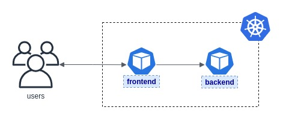

# Unidad 07 - Networking y Seguridad

¡Bienvenidos!

Esta práctica se corresponde a la unidad teórica número 7, dedicada exclusivamente a aspectos relacionados a `Networking` y `Seguridad` en el cluster, abarcando desde la exposición de pods al mundo exterior hasta visibilidad controlada y limitada entre las aplicaciones que conforman un cluster.

## Enunciado

#### Parte 1: Segmentando el monolito

Previo a iniciar esta práctica nos han llegado grandes noticias, finalmente el equipo de desarrollo pudo desacoplar en forma íntegra la aplicación monolítica que veníamos modelando de reserva de hoteles. Con lo cual ya es hora de pensar el `frontend` y el `backend` como **dos aplicaciones distintas**.

_Entonces, ¿Cómo debería quedar nuestra arquitectura ahora?_

Ciertamente, estamos en presencia de un gran inicio a lo que denominamos arquitecturas distribuídas de microservicios en Kubernetes.

Por eso mismo, nos solicitan modelar ambas aplicaciones, teniendo en consideración todos los últimos cambios que se fueron haciendo (variables externalizadas, probes, migrations, etc).

Pero hay un problema al respecto, necesitamos que ambas aplicaciones sean visibles y puedan comunicarse en el mismo _namespace_. Usted, como arquitecto, debe agregar en esta instancia lo necesario para que esto ocurra.

Consideraciones adicionales:

**Frontend**

- Se estandarizó la imagen del frontend bajo la siguiente etiqueta: `ghcr.io/go-elevate/k8s4arch-hotels-frontend:stable`
- Ahora requiere una variable de entorno para poder configurar **la dirección a donde comunicarse al backend** con el nombre `HOTELS_API_HOST` 
- Se recomienda fuertemente **evitar el uso de direcciones IP**, ya que no son estáticas y pueden eventualmente cambiar en algun despliegue (la plataforma entiende esta problemática y nos brinda una herramienta para optimizar el discovery de servicios).

**Backend**

- Esta aplicación no sólo contiene al backend sino también sus **migrations de bases de datos**.
- Se estandarizó la imagen del backend bajo la siguiente etiqueta: `ghcr.io/go-elevate/k8s4arch-hotels-backend:stable`
- Recordar agregar las variables que permiten indicar donde montar la base de datos.

Validar que la integración funcione correctamente, pueden utilizar el mismo frontend para visualizar la lista de hoteles, la cual es obtenida del backend y su _storage_.

#### Parte 2: Liberando la solución a los usuarios

Desde el negocio nos piden liberar esta versión ya desplegada y validada de la solución a algunos usuarios internos, para que empiezen a dar un _feedback_ apropiado y poder evolucionarla en los _sprints_ subsecuentes.

Para ello, lo que tenemos hasta ahora nos limita un poco, necesitamos acoplar la solución a un dominio un poco mas amigable para el negocio, donde eventualmente agregaremos algunas reglas de ruteo y certificados HTTPS para cuando se libere al mundo exterior.

Entonces, en esta sección, nuestra tarea es solventar esa problemática, para que los equipo de marketing y ventas puedan navegar un poco la aplicación.

Consideraciones adicionales:

- El dominio o _host_ a configurar es: `awesome-hotels.internal.itrip.io`
- No hay un _path_ o ruta en particular, se expondría en principio el root o `/`

#### Parte 3: Evitando accesos indeseados

El área de seguridad informática está al tanto de la nueva plataforma que maneja la organización y de las soluciones que se irán construyendo ahi mismo.

Tenemos su parte positivo desde el día 1 en este proceso de transformación, sin embargo expresaron la siguiente preocupación, no menor:  `¡Se deberán controlar los accesos no autorizados a las aplicaciones!`

Como siempre, la felicidad se acaba cuando llega seguridad con sus pretensiones. `¯\_(ツ)_/¯`

Sin embargo, nos pueden ahorrar mucho trabajo en lo que respecta a resolución de problemas, más aún si se sufre algún ataque, con lo cual conviene hacerles caso esta vez.

Sabemos que la plataforma nos provee una estrategia para aislar el tráfico o limitar la visiblidad entre aplicaciones de un cluster, por ende como arquitectos deberemos buscarle una solución a esta problemática presentada.

Consideraciones adicionales:

- **Únicamente** se permitirá el trafíco `frontend -> backend`, es decir, ninguna otra aplicación puede comunicarse con el backend de la solución.
- El tráfico de salida del backend será **denegado**, por defecto.

## Entrega y Devolución

Con respecto a esta entrega, se espera del alumno:

- **un manifiesto para cada parte/sección de la ejercitación** con lo que el alumno considera necesario y suficiente para solucionar la problemática presentada.
- Aclaración: la parte 1 se puede **reutilizar en las subsecuentes**.

El docente corregirá los manifiestos YAML, probándolos contra su entorno configurado de Kubernetes. En base a los resultados que arroje ese estado deseado, será la nota correspondiente para el alumno.  

La publicación oficial de la práctica será por la plataforma Google Classroom, donde se generará un material con devolución pautada para una fecha en particular y que es calificable.

## Aclaraciones

Al alumno se le proporcionó:

- un manual teórico con toda la información relevante a la unidad.
- un manual estilo guía o _walkthrough_ con información que puede utilizar a modo de soporte para la resolución de la ejercitación en cuestión.

Si alguno de estos documentos no está en su poder, contactarse con el personal docente para resolver la situación.