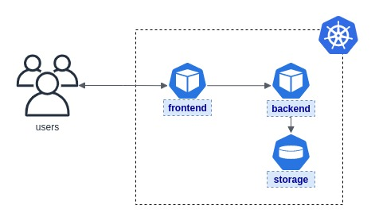

# Unidad 08 - Aplicaciones Stateful

¡Bienvenidos!

Esta práctica se corresponde a la unidad teórica número 8, dedicada exclusivamente a cómo modelar aplicaciones que mantienen un estado asociado persistente en la plataforma, dándoles un orden e identidad en los despliegues; y cómo esta decisión impacta en la infraestructura subyacente.

## Enunciado

Se nos presenta una última necesidad sobre la mesa: **evitar perder la información de los hoteles** en cada despliegue del backend de la solución.

El negocio validó la solución y nos dio un _feedback_ positivo, con lo cual se optó por encarar la migración a un ambiente productivo. El único inconveniente es que hoy en día cada vez que la aplicación se regenera, ¡estamos perdiendo el contenido de la base de datos! 

De cara a garantizar alta disponibilidad de la información que brinda la solución, nos piden como arquitectos encontrar una estrategia óptima para atacar esta problemática.

La arquitectura se mantendrá tal cual lo venimos trabajando, sólo que la información será externalizada en la capa adecuada para su gestión y durabilidad en el tiempo.

Consideraciones adicionales:

- **Reutilizar en su totalidad** la configuración resultante de la práctica anterior, es decir, considerar a las capas de la solución como aplicaciones independientes en la plataforma. No hace falta incluir las políticas de red de la última seccion vista.
- Evaluar los tipos de aprovisionamiento y decidir cuál utilizaría para este escenario. Considere que la capa de almacenamiento deberá ser reutilizada entre todas las aplicaciones gestionadas por la organización.
- El tamaño del storage no será considerable, es simplemente un archivo pequeño, por lo que lo limitaremos a `1Gb` de solicitud.
- El único que accederá a este volumen será el `backend` de la solución, escoger el tipo de acceso adecuado para el almacenamiento. Considere el factor de replicación de su aplicación.
- El nivel de servicio o tipo de almacenamiento dependerá exclusivamente de la infraestructura donde esté montada la plataforma, dejamos libertad absoluta al lector en definir el que prefiera.   

## Entrega y Devolución

Con respecto a esta entrega, se espera del alumno:

- **un manifiesto con la ejercitación completa** acorde a lo que el alumno considera necesario y suficiente para solucionar la problemática presentada.

El docente corregirá los manifiestos YAML, probándolos contra su entorno configurado de Kubernetes. En base a los resultados que arroje ese estado deseado, será la nota correspondiente para el alumno.  

La publicación oficial de la práctica será por la plataforma Google Classroom, donde se generará un material con devolución pautada para una fecha en particular y que es calificable.

## Aclaraciones

Al alumno se le proporcionó:

- un manual teórico con toda la información relevante a la unidad.
- un manual estilo guía o _walkthrough_ con información que puede utilizar a modo de soporte para la resolución de la ejercitación en cuestión.

Si alguno de estos documentos no está en su poder, contactarse con el personal docente para resolver la situación.